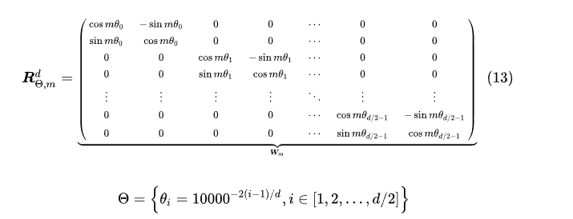
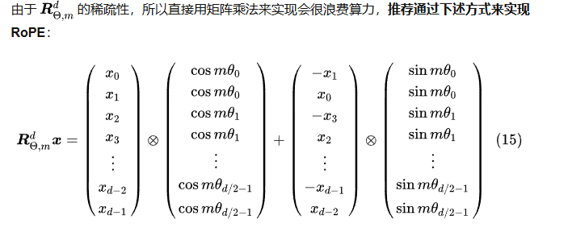

# BPE
### BPE 算法步骤（应用于 NLP 分词）

1.  **初始化：**
    -   将训练语料库中的所有文本拆分成一个个**字符**（或 UTF-8 字节）。
    -   将每个**单词**（通常添加一个特殊的结束符，如 `</w>`）视为一个由这些字符组成的序列。
    -   此时的“符号”就是单个字符（或字节）。初始词汇表就是所有出现的字符（或字节）加上可能的特殊符号（如 `<unk>`, `<s>`, `</s>`）。
    -   **示例（简化）：** 假设我们有单词 `"low"`, `"lower"`, `"newest"`, `"widest"`。初始化后：
        -   `l o w </w>`
        -   `l o w e r </w>`
        -   `n e w e s t </w>`
        -   `w i d e s t </w>`
        -   初始词汇表：`{l, o, w, e, r, n, s, t, i, d, </w>}`
2.  **统计频率：**
    -   统计训练语料库中所有**连续符号对**（`pair`）出现的频率。
    -   **示例：** 在上面的例子中，`o w` 在 `low` 和 `lower` 中出现，`w e` 在 `lower` 和 `newest` 中出现（注意 `newest` 的 `w` 和 `e` 是相邻的），等等。
3.  **合并最高频对：**
    -   找出当前语料库中出现**频率最高**的符号对（`pair`）。
    -   将这个 `pair` **合并**成一个新的符号（`new_symbol`），并添加到词汇表中。
    -   在语料库中，**所有**出现这个 `pair` 的地方都用新的 `new_symbol` 替换。
    -   **示例：** 假设频率最高的 `pair` 是 `e s`（在 `newest` 和 `widest` 中各出现一次）。合并后：
        -   `l o w </w>` (不变)
        -   `l o w e r </w>` (不变)
        -   `n e w es t </w>` (`e s` -> `es`)
        -   `w i d es t </w>` (`e s` -> `es`)
        -   新词汇表加入 `es`。
4.  **重复迭代：**
    -   重复步骤 2 和 3（重新统计新语料库中的符号对频率，然后合并最高频对）。
    -   每次合并都会：
        -   减少语料库中符号序列的总长度（因为两个符号合并成了一个）。
        -   在词汇表中添加一个新的符号（代表一个更常见的子词单元）。
        -   创建一个更大粒度的表示。
    -   **示例迭代 2：** 假设现在频率最高的 `pair` 是 `es t`（在 `newest` 和 `widest` 中各出现一次）。合并后：
        -   `l o w </w>`
        -   `l o w e r </w>`
        -   `n e w est </w>` (`es t` -> `est`)
        -   `w i d est </w>` (`es t` -> `est`)
        -   新词汇表加入 `est`。
    -   **示例迭代 3：** 假设现在频率最高的 `pair` 是 `l o`（在 `low` 和 `lower` 中各出现一次）。合并后：
        -   `lo w </w>` (`l o` -> `lo`)
        -   `lo w e r </w>` (`l o` -> `lo`)
        -   `n e w est </w>`
        -   `w i d est </w>`
        -   新词汇表加入 `lo`。
    -   **示例迭代 4：** 假设现在频率最高的 `pair` 是 `lo w`（在 `low` 和 `lower` 中各出现一次）。合并后：
        -   `low </w>` (`lo w` -> `low`)
        -   `low e r </w>` (`lo w` -> `low`)
        -   `n e w est </w>`
        -   `w i d est </w>`
        -   新词汇表加入 `low`。
5.  **停止条件：**
    -   迭代过程持续进行，直到达到预设的**词汇表大小（Vocabulary Size）** 目标（例如 10k, 30k, 50k）。
    -   或者，直到没有可以合并的符号对（频率 > 0）为止（但通常会在达到目标词汇表大小前停止）。

### 最终结果

-   **词汇表：** 包含初始字符、所有合并过程中创建的新符号（子词单元），以及任何预定义的特殊符号（`<unk>`, `<s>`, `</s>` 等）。

-   **分词规则：** 词汇表中存储的符号就是可以用于分词的“词片（subword units）”。BPE 算法本身定义的是如何构建这个词汇表。

-   **分词算法（应用阶段）：**

    1.  将一个新单词拆分成字符序列（通常也加上 `</w>`）。
    2.  查找词汇表中存在的**最长可能子词**（从单词开头开始），贪婪地进行匹配。
    3.  对剩余部分重复步骤 2，直到整个单词被分割成词汇表中存在的子词序列。
    4.  如果遇到无法匹配的字符（非常罕见），通常映射到 `<unk>`。

    -   **示例（用上面训练好的词汇表分词 `"lowest"`）：**
        -   初始：`l o w e s t </w>`
        -   应用规则：词汇表里有 `low`（覆盖了开头的 `l o w`），然后剩下 `e s t </w>`。
        -   词汇表里有 `est`（覆盖了 `e s t`）。
        -   最终分词结果：`low est </w>`。
```python
from collections import defaultdict, Counter
import re

class BPETokenizer:
    def __init__(self, special_tokens=None):
        self.vocab = None
        self.merges = None
        self.special_tokens = special_tokens or []
        self.word_freq = None
    
    def preprocess(self, corpus):
        """将语料拆分为单词并添加结束符</w>"""
        words = []
        for text in corpus:
            # 按空格分割单词（可根据需求调整）
            for word in re.findall(r'\w+|[^\w\s]', text):
                words.append(word.lower() + '</w>')  # 添加结束符
        return Counter(words)
    
    def get_stats(self):
        """统计当前语料中相邻字符对的频率"""
        pairs = defaultdict(int)
        for word, freq in self.word_freq.items():
            symbols = word.split()
            for i in range(len(symbols) - 1):
                pairs[(symbols[i], symbols[i+1])] += freq
        return pairs
    
    def merge_pair(self, a, b):
        """合并字符对(a, b) -> ab"""
        new_word_freq = defaultdict(int)
        new_symbol = a + b
        
        for word, freq in self.word_freq.items():
            new_word = word.replace(f"{a} {b}", new_symbol)
            new_word_freq[new_word] = freq
        
        self.word_freq = new_word_freq
        self.merges.append((a, b))
        self.vocab.add(new_symbol)
    
    def train(self, corpus, vocab_size):
        """训练BPE分词器"""
        # 初始化
        self.word_freq = self.preprocess(corpus)
        self.vocab = set()
        self.merges = []
        
        # 添加基础字符
        for word in self.word_freq:
            for char in word.split():
                self.vocab.add(char)
        
        # 添加特殊标记
        for token in self.special_tokens:
            self.vocab.add(token)
        
        # 迭代合并
        while len(self.vocab) < vocab_size:
            pairs = self.get_stats()
            if not pairs:
                break
            
            # 选择频率最高的字符对
            best_pair = max(pairs, key=pairs.get)
            self.merge_pair(*best_pair)
        
        return self.vocab, self.merges
    
    def tokenize(self, text):
        """使用训练结果分词新文本"""
        if not self.merges:
            raise ValueError("Tokenizer not trained!")
        
        # 预处理单词
        words = [word.lower() + '</w>' for word in re.findall(r'\w+|[^\w\s]', text)]
        tokens = []
        
        for word in words:
            # 初始化为单个字符
            symbols = [char for char in word[:-4]] + [word[-4:]]  # 处理</w>
            
            # 应用所有合并规则
            for a, b in self.merges:
                new_symbols = []
                i = 0
                while i < len(symbols):
                    if i < len(symbols) - 1 and symbols[i] == a and symbols[i+1] == b:
                        new_symbols.append(a + b)
                        i += 2
                    else:
                        new_symbols.append(symbols[i])
                        i += 1
                symbols = new_symbols
            
            tokens.extend(symbols)
        
        return tokens

# 示例使用
if __name__ == "__main__":
    # 1. 准备语料
    corpus = [
        "This is the Hugging Face Course.",
        "This chapter is about tokenization."
    ]
    
    # 2. 训练分词器（目标词汇表大小=50）
    tokenizer = BPETokenizer(special_tokens=["<unk>"])
    vocab, merges = tokenizer.train(corpus, vocab_size=50)
    
    print("Vocabulary:", sorted(vocab))
    print("Merges:", merges)
    
    # 3. 测试分词
    text = "This tokenization is about Hugging."
    tokens = tokenizer.tokenize(text)
    print(f"Tokens for '{text}':", tokens)
```

# RMSNorm
对每个值进行缩放，原理就是先计算所有值的平方和，在取平均，在取平方根，然后所有值来除以这个结果。
```python
class RMSNorm(torch.nn.Module):
    def __init__(self, dim: int, eps: float = 1e-5):
        super().__init__()
        self.eps = eps
        self.weight = nn.Parameter(torch.ones(dim))

    def _norm(self, x):
        return x * torch.rsqrt(x.pow(2).mean(-1, keepdim=True) + self.eps)

    def forward(self, x):
        return self.weight * self._norm(x.float()).type_as(x)
```

# RoPE
参考阅读：  
https://www.zhihu.com/tardis/bd/art/647109286  
https://zhuanlan.zhihu.com/p/642884818

本质就是欧拉公式讲$e^{im\theta}$转为复数 $cos({m\theta})+i\space sin({m\theta})$，然后讲q和v转为复数形式，相乘后，发现就是旋转矩阵。  





torch.outer是计算两个矩阵的外积，是向量中的每一个元素与另外一个向量中的每一个元素相乘，结果不是一个标量，而是一个矩阵。  
torch.arange(start, end, step)，生成从start到end的步长为step的range  
torch.polar(abs, angle, *, out=None)。 $out = abs*cos(angle) + i*sin(angle)$  

LLaMA的实现是按照转为欧拉公式后按照复数相乘的思路来的，最贴近论文提出的原本的方法。  
```python
# 生成旋转矩阵
def precompute_freqs_cis(dim: int, seq_len: int, theta: float = 10000.0):
    # 计算词向量元素两两分组之后，每组元素对应的旋转角度\theta_i
    freqs = 1.0 / (theta ** (torch.arange(0, dim, 2)[: (dim // 2)].float() / dim))
    # 生成 token 序列索引 t = [0, 1,..., seq_len-1]
    t = torch.arange(seq_len, device=freqs.device)
    # freqs.shape = [seq_len, dim // 2] 
    freqs = torch.outer(t, freqs).float()  # 计算m * \theta

    # 计算结果是个复数向量
    # 假设 freqs = [x, y]
    # 则 freqs_cis = [cos(x) + sin(x)i, cos(y) + sin(y)i]
    freqs_cis = torch.polar(torch.ones_like(freqs), freqs) 
    return freqs_cis

# 旋转位置编码计算
def apply_rotary_emb(
    xq: torch.Tensor,
    xk: torch.Tensor,
    freqs_cis: torch.Tensor,
) -> Tuple[torch.Tensor, torch.Tensor]:
    # xq.shape = [batch_size, seq_len, dim]
    # xq_.shape = [batch_size, seq_len, dim // 2, 2]
    # 将最后一维分成两个一对的维度
    xq_ = xq.float().reshape(*xq.shape[:-1], -1, 2)
    xk_ = xk.float().reshape(*xk.shape[:-1], -1, 2)
    
    # 转为复数域
    xq_ = torch.view_as_complex(xq_)
    xk_ = torch.view_as_complex(xk_)
    
    # 应用旋转操作，然后将结果转回实数域
    # xq_out.shape = [batch_size, seq_len, dim]
    xq_out = torch.view_as_real(xq_ * freqs_cis).flatten(2)
    xk_out = torch.view_as_real(xk_ * freqs_cis).flatten(2)
    return xq_out.type_as(xq), xk_out.type_as(xk)
```

minimind的实现则是分别计算cos和sin，即上面第二个图片演示的方法计算
```python
def precompute_freqs_cis(dim: int, end: int = int(32 * 1024), theta: float = 1e6):
    freqs = 1.0 / (theta ** (torch.arange(0, dim, 2)[: (dim // 2)].float() / dim))
    t = torch.arange(end, device=freqs.device)
    freqs = torch.outer(t, freqs).float()
    freqs_cos = torch.cat([torch.cos(freqs), torch.cos(freqs)], dim=-1)
    freqs_sin = torch.cat([torch.sin(freqs), torch.sin(freqs)], dim=-1)
    return freqs_cos, freqs_sin


def apply_rotary_pos_emb(q, k, cos, sin, position_ids=None, unsqueeze_dim=1):
    def rotate_half(x):
        return torch.cat((-x[..., x.shape[-1] // 2:], x[..., : x.shape[-1] // 2]), dim=-1)

    q_embed = (q * cos.unsqueeze(unsqueeze_dim)) + (rotate_half(q) * sin.unsqueeze(unsqueeze_dim))
    k_embed = (k * cos.unsqueeze(unsqueeze_dim)) + (rotate_half(k) * sin.unsqueeze(unsqueeze_dim))
    return q_embed, k_embed
```

# grouped-query attention

```python
def repeat_kv(x: torch.Tensor, n_rep: int) -> torch.Tensor:
    """torch.repeat_interleave(x, dim=2, repeats=n_rep)"""
    bs, slen, num_key_value_heads, head_dim = x.shape
    if n_rep == 1:
        return x
    return (
        x[:, :, :, None, :]
        .expand(bs, slen, num_key_value_heads, n_rep, head_dim)
        .reshape(bs, slen, num_key_value_heads * n_rep, head_dim)
    )
```

代码讲解  
- x[:, :, :, None, :]  # 在维度2和3之间插入新维度 相当于x.unsqueeze(3)
- tensor.expand 将新维度从1扩展到n_rep, 零拷贝操作，不会实际复制数据，只是创建视图

```python
# 更直观但低效的实现
def repeat_kv_simple(x, n_rep):
    if n_rep == 1:
        return x
    return x.repeat(1, 1, n_rep, 1)
    
# 使用repeat_interleave的实现
def repeat_kv_interleave(x, n_rep):
    return torch.repeat_interleave(x, n_rep, dim=2)
```

# minimind Attention
attention mask是在上三角的基础上叠加。

```python
def forward(self,
                x: torch.Tensor,
                position_embeddings: Tuple[torch.Tensor, torch.Tensor],  # 修改为接收cos和sin
                past_key_value: Optional[Tuple[torch.Tensor, torch.Tensor]] = None,
                use_cache=False,
                attention_mask: Optional[torch.Tensor] = None):
        bsz, seq_len, _ = x.shape
        xq, xk, xv = self.q_proj(x), self.k_proj(x), self.v_proj(x)
        xq = xq.view(bsz, seq_len, self.n_local_heads, self.head_dim)
        xk = xk.view(bsz, seq_len, self.n_local_kv_heads, self.head_dim)
        xv = xv.view(bsz, seq_len, self.n_local_kv_heads, self.head_dim)

        cos, sin = position_embeddings
        xq, xk = apply_rotary_pos_emb(xq, xk, cos[:seq_len], sin[:seq_len])

        # kv_cache实现
        if past_key_value is not None:
            xk = torch.cat([past_key_value[0], xk], dim=1)
            xv = torch.cat([past_key_value[1], xv], dim=1)
        past_kv = (xk, xv) if use_cache else None

        xq, xk, xv = (
            xq.transpose(1, 2),
            repeat_kv(xk, self.n_rep).transpose(1, 2),
            repeat_kv(xv, self.n_rep).transpose(1, 2)
        )

        if self.flash and seq_len != 1:
            dropout_p = self.dropout if self.training else 0.0
            attn_mask = None
            if attention_mask is not None:
                attn_mask = attention_mask.view(bsz, 1, 1, -1).expand(bsz, self.n_local_heads, seq_len, -1)
                attn_mask = attn_mask.bool() if attention_mask is not None else None

            output = F.scaled_dot_product_attention(xq, xk, xv, attn_mask=attn_mask, dropout_p=dropout_p, is_causal=True)
        else:
            scores = (xq @ xk.transpose(-2, -1)) / math.sqrt(self.head_dim)
            scores = scores + torch.triu(
                torch.full((seq_len, seq_len), float("-inf"), device=scores.device),
                diagonal=1
            ).unsqueeze(0).unsqueeze(0)  # scores+mask

            if attention_mask is not None:
                extended_attention_mask = attention_mask.unsqueeze(1).unsqueeze(2)
                extended_attention_mask = (1.0 - extended_attention_mask) * -1e9
                scores = scores + extended_attention_mask

            scores = F.softmax(scores.float(), dim=-1).type_as(xq)
            scores = self.attn_dropout(scores)
            output = scores @ xv

        output = output.transpose(1, 2).reshape(bsz, seq_len, -1)
        output = self.resid_dropout(self.o_proj(output))
        return output, past_kv
```

# MoE
一个专家就是一个神经网络模块，通常就是MLP  
经过一个transformer block后，会有一个MoEGate。MoEGate接收x(batch, seq_len, hidden_dim)，然后生成routered_expert的概率，选择topk，然后经过这下expert后求加权和（根据前面的gate概率），再和shared_expert的输出结果相加。  

# Lora

lora根据矩阵乘法，将大矩阵拆成两个矩阵相乘。  
加在原来的model上就是两部分结果相加。
```python
# 定义Lora网络结构
class LoRA(nn.Module):
    def __init__(self, in_features, out_features, rank):
        super().__init__()
        self.rank = rank  # LoRA的秩（rank），控制低秩矩阵的大小
        self.A = nn.Linear(in_features, rank, bias=False)  # 低秩矩阵A
        self.B = nn.Linear(rank, out_features, bias=False)  # 低秩矩阵B
        # 矩阵A高斯初始化
        self.A.weight.data.normal_(mean=0.0, std=0.02)
        # 矩阵B全0初始化
        self.B.weight.data.zero_()

    def forward(self, x):
        return self.B(self.A(x))


def apply_lora(model, rank=8):
    for name, module in model.named_modules():
        if isinstance(module, nn.Linear) and module.weight.shape[0] == module.weight.shape[1]:
            lora = LoRA(module.weight.shape[0], module.weight.shape[1], rank=rank).to(model.device)
            setattr(module, "lora", lora)
            original_forward = module.forward

            # 显式绑定
            def forward_with_lora(x, layer1=original_forward, layer2=lora):
                return layer1(x) + layer2(x)

            module.forward = forward_with_lora


def load_lora(model, path):
    state_dict = torch.load(path, map_location=model.device)
    for name, module in model.named_modules():
        if hasattr(module, 'lora'):
            lora_state = {k.replace(f'{name}.lora.', ''): v for k, v in state_dict.items() if f'{name}.lora.' in k}
            module.lora.load_state_dict(lora_state)


def save_lora(model, path):
    state_dict = {}
    for name, module in model.named_modules():
        if hasattr(module, 'lora'):
            lora_state = {f'{name}.lora.{k}': v for k, v in module.lora.state_dict().items()}
            state_dict.update(lora_state)
    torch.save(state_dict, path)

```
