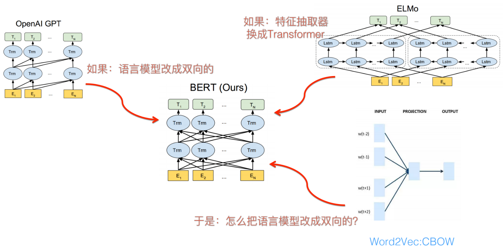

# NLP面试题

### 1.BERT

#### 1.1 基础知识

BERT（Bidirectional Encoder Representations from Transformers）是谷歌提出，作为一个Word2Vec的替代者，其在NLP领域的11个方向大幅刷新了精度，可以说是近年来自残差网络最优突破性的一项技术了。论文的主要特点以下几点：

1. 使用了双向Transformer作为算法的主要框架，之前的模型是从左向右输入一个文本序列，或者将 left-to-right 和 right-to-left 的训练结合起来，实验的结果表明，双向训练的语言模型对语境的理解会比单向的语言模型更深刻；
2. 使用了Mask Language Model(MLM)和 Next Sentence Prediction(NSP) 的多任务训练目标；
3. 使用更强大的机器训练更大规模的数据，使BERT的结果达到了全新的高度，并且Google开源了BERT模型，用户可以直接使用BERT作为Word2Vec的转换矩阵并高效的将其应用到自己的任务中。

BERT 只利用了 Transformer 的 encoder 部分。因为BERT 的目标是生成语言模型，所以只需要 encoder 机制。

BERT有两个任务：

1. Masked LM (MLM) : 在将单词序列输入给 BERT 之前，每个序列中有 15％ 的单词被 `[MASK]` token 替换。 然后模型尝试基于序列中其他未被 mask 的单词的上下文来预测被掩盖的原单词。在BERT的实验中，15%的WordPiece Token会被随机Mask掉。在训练模型时，一个句子会被多次喂到模型中用于参数学习，但是Google并没有在每次都mask掉这些单词，而是在确定要Mask掉的单词之后，80%的概率会直接替换为`[Mask]`，10%的概率将其替换为其它任意单词，10%的概率会保留原始Token。
   1. **80% 的 tokens 会被替换为 \[MASK] token**：**是 Masked LM 中的主要部分，可以在不泄露 label 的情况下融合真双向语义信息**；
   2. **10% 的 tokens 会称替换为随机的 token** ：因为需要在最后一层随机替换的这个 token 位去预测它真实的词，而模型并不知道这个 token 位是被随机替换的，就迫使模型尽量在每一个词上都学习到一个 全局语境下的表征，因而也能够让 BERT 获得更好的语境相关的词向量（**这正是解决一词多义的最重要特性**）；
   3. \*\*10% 的 tokens 会保持不变但需要被预测 \*\*：这样能够给模型一定的 bias ，相当于是额外的奖励，将模型对于词的表征能够拉向词的 真实表征
2. Next Sentence Prediction (NSP) : 在 BERT 的训练过程中，模型接收成对的句子作为输入，并且预测其中第二个句子是否在原始文档中也是后续句子。
   1. 在训练期间，50％ 的输入对在原始文档中是前后关系，另外 50％ 中是从语料库中随机组成的，并且是与第一句断开的。
   2. 在第一个句子的开头插入 `[CLS]` 标记，表示该特征用于分类模型，对非分类模型，该符号可以省去，在每个句子的末尾插入 `[SEP]` 标记，表示分句符号，用于断开输入语料中的两个句子。

ERT的输入的编码向量（长度是512）是3个嵌入特征的单位和，这三个词嵌入特征是：

1. **位置嵌入（Position Embedding）**：位置嵌入是指将单词的位置信息编码成特征向量，位置嵌入是向模型中引入单词位置关系的至关重要的一环；
2. **WordPiece 嵌入**：WordPiece是指将单词划分成一组有限的公共子词单元，能在单词的有效性和字符的灵活性之间取得一个折中的平衡。例如上图的示例中‘playing’被拆分成了‘play’和‘ing’；
3. **分割嵌入（Segment Embedding）**：用于区分两个句子，例如B是否是A的下文（对话场景，问答场景等）。对于句子对，第一个句子的特征值是0，第二个句子的特征值是1。」

### 2.文本嵌入

在传统的NLP中，将单词视为离散符号，然后可以用one-hot向量表示。向量的维度是整个词汇表中单词的数量。单词作为离散符号的问题在于，对于one-hot向量来说，没有自然的相似性概念。

因此，另一种方法是学习在向量本身中编码相似性。核心思想是一个词的含义是由经常出现在其旁边的单词给出的。

文本嵌入是字符串的实值向量表示。为每个单词建立一个密集的向量，选择它以便类似于类似上下文中出现的单词的向量。

在词嵌入中最流行的应该是Word2vec，它是由谷歌（Mikolov）开发的模型，其中固定词汇表中的每个词都由一个向量表示。然后，通过文本中的每个位置`t`，其中有一个中心词`c`和上下文词`o`。

Word2vec有两个变体：

1. `Skip-Gram`：考虑一个包含`k`个连续项的上下文窗口。然后，跳过其中一个单词，尝试学习一个神经网络，该网络可以获得除跳过的所有术语外的所有术语，并预测跳过的术语。
   因此，如果两个单词在大语料库中反复共享相似的上下文，那么这些术语的嵌入向量将具有相似的向量。
2. `Continuous Bag of Words`：在一个大的语料库中获取大量的句子，每当看到一个词，就会联想到周围的词。然后，将上下文单词输入到神经网络，并预测该上下文中心的单词。当有数千个这样的上下文单词和中心单词时，就有了一个神经网络数据集的实例。训练神经网络，最后编码的隐藏层输出表示一个特定的词嵌入。当通过大量的句子进行训练时，类似上下文中的单词会得到相似的向量。

对`Skip-Gram`和`CBOW`的一个吐槽就是它们都是基于窗口的模型，这意味着语料库的共现统计不能被有效使用，导致次优的嵌入（suboptimal embeddings）。

### 3.对比BERT、OpenAI GPT、ELMo架构之间的差异

- `BERT`使用双向Encoder，模型的表示在所有层中，共同依赖于左右两侧的上下文
- `OpenAI GPT`使用单向Encoder，利用了 Transformer 的编码器作为语言模型进行预训练的，之后特定的自然语言处理任务在其基础上进行微调即可。
- `ELMo`使用独立训练的从左到右和从右到左LSTM级联来生成下游任务的特征。是一种双层双向的 LSTM 结构，其训练的语言模型可以学习到句子左右两边的上下文信息，但此处所谓的上下文信息并不是真正意义上的上下文。

三种模型中只有BERT表征基于所有层左右两侧语境。

### 4.Word2Vec中为什么使用负采样（negtive sample）？

负采样是另一种用来提高Word2Vec效率的方法，它是基于这样的观察：训练一个神经网络意味着使用一个训练样本就要稍微调整一下神经网络中所有的权重，这样才能够确保预测训练样本更加精确，**如果能设计一种方法每次只更新一部分权重，那么计算复杂度将大大降低**。

将以上观察引入Word2Vec就是：当通过（”fox”, “quick”)词对来训练神经网络时，回想起这个神经网络的“标签”或者是“正确的输出”是一个one-hot向量。也就是说，对于神经网络中对应于”quick”这个单词的神经元对应为1，而其他上千个的输出神经元则对应为0。

使用负采样，通过随机选择一个较少数目（比如说5个）的“负”样本来更新对应的权重。(在这个条件下，“负”单词就是希望神经网络输出为0的神经元对应的单词）。并且仍然为“正”单词更新对应的权重（也就是当前样本下”quick”对应的神经元仍然输出为1）。

负采样这个点引入word2vec非常巧妙，两个作用：

1. **加速了模型计算**
2. **保证了模型训练的效果**，其一 模型每次只需要更新采样的词的权重，不用更新所有的权重，那样会很慢，其二 中心词其实只跟它周围的词有关系，位置离着很远的词没有关系，也没必要同时训练更新，作者这点非常聪明。

### 5.word2vec 相比之前的 Word Embedding 方法好在什么地方？

无论是`CBOW`还是`Skip-Gram`，本质还是要**基于word和context做文章**，即可以理解为模型在学习word和context的co-occurrence。

Word2vec训练方面采用的HSoftmax以及负采样确实可以认为是创新不大。但Word2vec流行的主要原因也不在于此。主要原因在于以下3点：

1. **极快的训练速度**。以前的语言模型优化的目标是MLE，只能说词向量是其副产品。Mikolov应该是第一个提出抛弃MLE（和困惑度）指标，就是要学习一个好的词嵌入。如果不追求MLE，模型就可以大幅简化，去除隐藏层。再利用HSoftmax以及负采样的加速方法，可以使得训练在小时级别完成。而原来的语言模型可能需要几周时间。
2. **一个很酷炫的man-woman=king-queen的示例**。这个示例使得人们发现词嵌入还可以这么玩，并促使词嵌入学习成为了一个研究方向，而不再仅仅是神经网络中的一些参数。
3. word2vec里有大量的tricks，比如噪声分布如何选？如何采样？如何负采样？等等。这些tricks虽然摆不上台面，但是对于得到一个好的词向量至关重要。

### 6.NLP预训练发展史：从Word Embedding到BERT

图像预训练 → word embedding → word2vec → elmo → transformer → gpt → bert → GPT 234

### 7.NLP三大特征抽取器（CNN/RNN/TF）

> 摘自文章：[自然语言处理三大特征抽取器](https://zhuanlan.zhihu.com/p/54743941 "自然语言处理三大特征抽取器")

**结论**：RNN已经基本完成它的历史使命，将来会逐步退出历史舞台；CNN如果改造得当，将来还是有希望有自己在NLP领域的一席之地；而Transformer明显会很快成为NLP里担当大任的最主流的特征抽取器。

NLP任务的特点：输入是个一维线性序列；输入不定长；单词或句子的位置关系很重要；句子中长距离特征对于语义理解也很重要。

> **一个特征抽取器是否适配问题领域的特点，有时候决定了它的成败，而很多模型改进的方向，其实就是改造得使得它更匹配领域问题的特性**。

#### RNN

采取线性序列结构不断从前往后收集输入信息，但这种线性序列结构在反向传播的时候存在优化困难问题，因为反向传播路径太长，容易导致严重的梯度消失或梯度爆炸问题。为了解决这个问题，后来引入了LSTM和GRU模型，通过增加中间状态信息直接向后传播，以此缓解梯度消失问题，获得了很好的效果，于是很快LSTM和GRU成为RNN的标准模型。经过不断优化，后来NLP又从图像领域借鉴并引入了attention机制（从这两个过程可以看到不同领域的相互技术借鉴与促进作用），叠加网络把层深作深，以及引入Encoder-Decoder框架，这些技术进展极大拓展了RNN的能力以及应用效果。

RNN的结构天然适配解决NLP的问题，NLP的输入往往是个不定长的线性序列句子，而RNN本身结构就是个可以接纳不定长输入的由前向后进行信息线性传导的网络结构，而在LSTM引入三个门后，对于捕获长距离特征也是非常有效的。所以RNN特别适合NLP这种线形序列应用场景，这是RNN为何在NLP界如此流行的根本原因。

RNN在新时代面临的两个问题：

1. 一些新模型的崛起：特殊改造的CNN；Transformer
2. RNN结构存在序列依赖，对大规模并行非常不友好

#### CNN

CNN捕获的特征其实的单词的`k-gram`片段信息，`k`的大小决定了能捕获多远距离的特征。

目前NLP界主流的CNN：

通常由1-D卷积层来叠加深度，使用Skip Connection来辅助优化，也可以引入Dilated CNN等手段。

CNN的卷积层其实是保留了相对位置信息的，CNN的并行计算能力，那是非常强的。

#### Transformer

自然语言一般是个不定长的句子，那么这个不定长问题怎么解决呢？Transformer做法跟CNN是类似的，一般设定输入的最大长度，如果句子没那么长，则用Padding填充，这样整个模型输入起码看起来是定长的了。

#### 三大抽取器比较

1. 语义特征提取能力：Transformer在这方面的能力非常显著地超过RNN和CNN，RNN和CNN两者能力差不太多。
2. 长距离特征捕获能力：原生CNN特征抽取器在这方面极为显著地弱于RNN和Transformer，Transformer微弱优于RNN模型(尤其在主语谓语距离小于13时)，能力由强到弱排序为Transformer>RNN>>CNN; 但在比较远的距离上（主语谓语距离大于13），RNN微弱优于Transformer，所以综合看，可以认为Transformer和RNN在这方面能力差不太多，而CNN则显著弱于前两者。
3. 任务综合特征抽取能力（机器翻译）：Transformer综合能力要明显强于RNN和CNN，而RNN和CNN看上去表现基本相当，貌似CNN表现略好一些。
4. 并行计算能力及运行效率：RNN在并行计算方面有严重缺陷，这是它本身的序列依赖特性导致的；对于CNN和Transformer来说，因为它们不存在网络中间状态不同时间步输入的依赖关系，所以可以非常方便及自由地做并行计算改造。Transformer和CNN差不多，都远远远远强于RNN。

#### 综合排名

***单从任务综合效果方面来说，Transformer明显优于CNN，CNN略微优于RNN。速度方面Transformer和CNN明显占优，RNN在这方面劣势非常明显。***

三者的结合：向Transformer靠拢

### 8.常用参数更新方法

**梯度下降**：在一个方向上更新和调整模型的参数，来最小化损失函数。

**随机梯度下降（Stochastic gradient descent，SGD）** 对每个训练样本进行参数更新，每次执行都进行一次更新，且执行速度更快。

为了避免SGD和标准梯度下降中存在的问题，一个改进方法为**小批量梯度下降**（Mini Batch Gradient Descent），因为对每个批次中的n个训练样本，这种方法只执行一次更新。

使用小批量梯度下降的优点是：

1\) 可以减少参数更新的波动，最终得到效果更好和更稳定的收敛。

2\) 还可以使用最新的深层学习库中通用的矩阵优化方法，使计算小批量数据的梯度更加高效。

3\) 通常来说，小批量样本的大小范围是从50到256，可以根据实际问题而有所不同。

4\) 在训练神经网络时，通常都会选择小批量梯度下降算法。

**SGD方法中的高方差振荡使得网络很难稳定收敛**，所以有研究者提出了一种称为**动量（Momentum）的技术**，通过优化相关方向的训练和弱化无关方向的振荡，来加速SGD训练。

**Nesterov梯度加速法**，通过使网络更新与误差函数的斜率相适应，并依次加速SGD，也可根据每个参数的重要性来调整和更新对应参数，以执行更大或更小的更新幅度。

**AdaDelta方法**是AdaGrad的延伸方法，它倾向于解决其学习率衰减的问题。Adadelta不是累积所有之前的平方梯度，而是将累积之前梯度的窗口限制到某个固定大小w。

**Adam算法**即自适应时刻估计方法（Adaptive Moment Estimation），能计算每个参数的自适应学习率。这个方法不仅存储了AdaDelta先前平方梯度的指数衰减平均值，而且保持了先前梯度M(t)的指数衰减平均值，这一点与动量类似。

Adagrad方法是通过参数来调整合适的学习率η，对稀疏参数进行大幅更新和对频繁参数进行小幅更新。因此，Adagrad方法非常适合处理稀疏数据。
