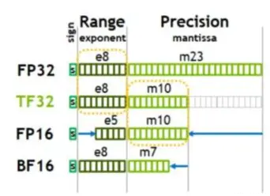

# 1.显存问题

\[toc]

### 1. 大模型大概有多大，模型文件有多大?

大模型也分为**不同的规格**，一般模型的规格会体现在模型的名称上，例如 LLaMA2-13b，13b 就是其模型参数量的大小，意思是 130亿的参数量。大模型的文件大小与其参数量有关，通常大模型是以半精度存储的， Xb 的模型文件大概是 2X GB多一些，例如 13b 的模型文件大小大约是 27GB 左右。

### 2. 能否用4 \* v100 32G训练vicuna 65b？

一般来说**推理模型需要的显存约等于模型文件大小，全参训练需要的显存约为推理所需显存的三倍到四倍**，正常来说，在不量化的情况下4张 v100 显卡推理 65b 的模型都会有一些吃力，无法进行训练，需要通过 **LoRA 或者****QLoRA** 采用低秩分解的方式才可以训练。

### 3.如何评估你的显卡利用率?

1.  **flops比值法**：**`gpu利用率 = 实测的flops/显卡理论上的峰值flops`**。deepspeed实测flops 100t flops，而用的是A100卡理论峰值312t flops，可以得到GPU利用率只有 32.05%。
2.  **throughout估计法**：`吞吐量 = example数量/秒/GPU * max_length`；**`gpu利用率 = 实际吞吐量 / 论文中的吞吐量（假设利用率100%）`**，实测训练时处理样本速度为 3 example/s，一共有4卡，max length 2048，则吞吐量为 1536 token/s/gpu，根据llama论文可以得知，他们训练7B模型的吞吐量约为 3300 token/s/gpu，那么GPU利用率只有46.54%
3.  **torch profiler分析法**：利用torch profiler记录各个函数的时间，将结果在tensorboard上展示，在gpu kenel视图下，可以看到tensor core的利用率，比如30%。

### 4. 如何查看多机训练时的网速？

```bash
iftop -i eth2 -n  -P
```

`iftop `是外置的命令，可以监控发送流量，接收流量，总流量，运行 `iftop `到目前时间的总流量，流量峰值，过去 2s 10s 40s 的平均流量。

### 5. 如何查看服务器上的多卡之间的NVLINK topo？

```bash
nvidia-smi topo -m 
```

### 6. 如何查看服务器上显卡的具体型号?

```bash
cd /usr/local/cuda/samples/1_Utilities/deviceQuery
make
./deviceQuery
```

### 7. 如何查看训练时的 flops？（也就是每秒的计算量）

如果基于deepspeed训练，可以通过配置文件很方便地测试。

```json
{
  "flops_profiler": {
    "enabled": true,
    "profile_step": 1,
    "module_depth": -1,
    "top_modules": 1,
    "detailed": true,
    "output_file": null
    }
}

```

### 8. 如何查看对 deepspeed 的环境配置是否正确？

```bash
ds_report
```

### 9. TF32 格式有多长？

TF32（TensorFloat32）是 NVIDIA 在 Ampere 架构推出的时候面世的，现已成为 Tensorflow 和 Pytorch 框架中默认的32位格式。用于近似 FP32 精度下任务的专有格式，实际上约等于 FP19 也就是19位。


