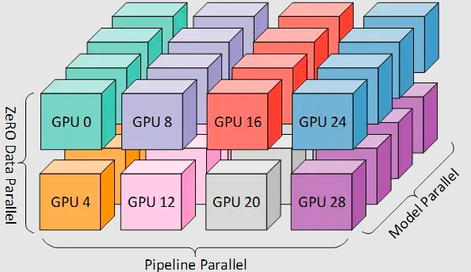
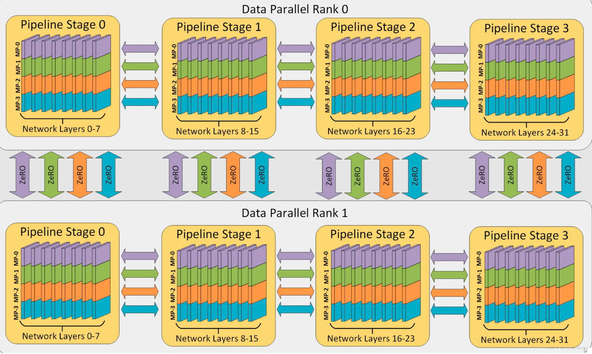
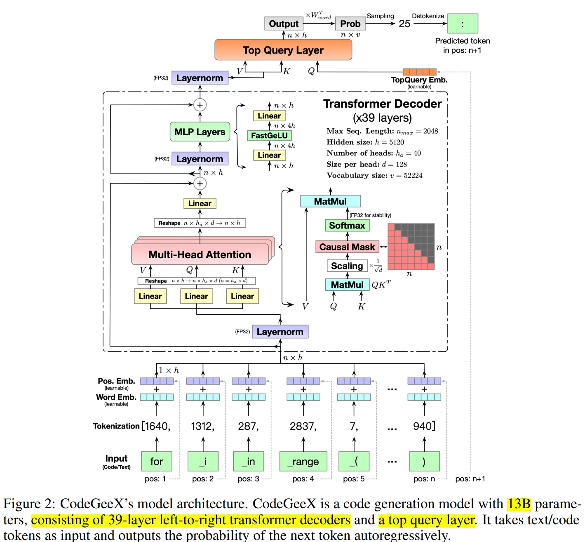
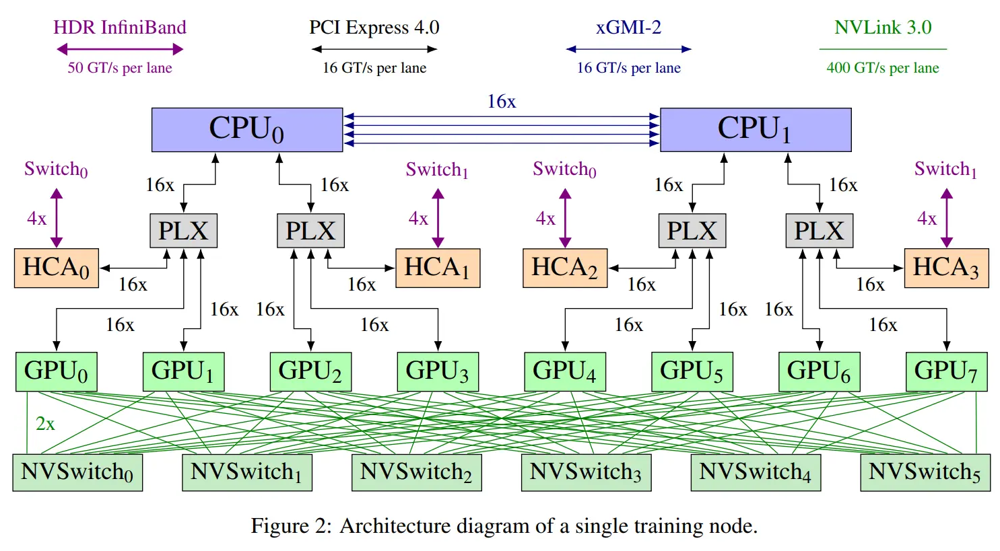
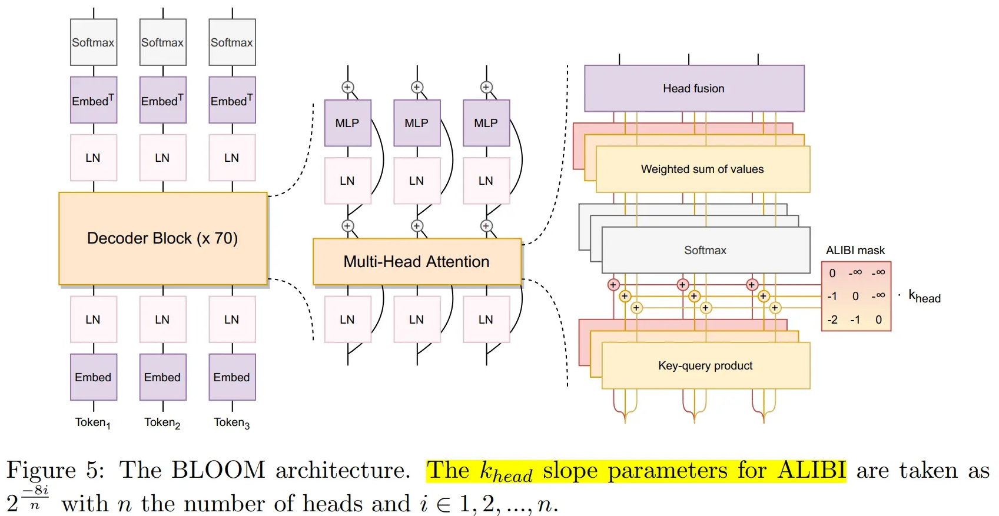
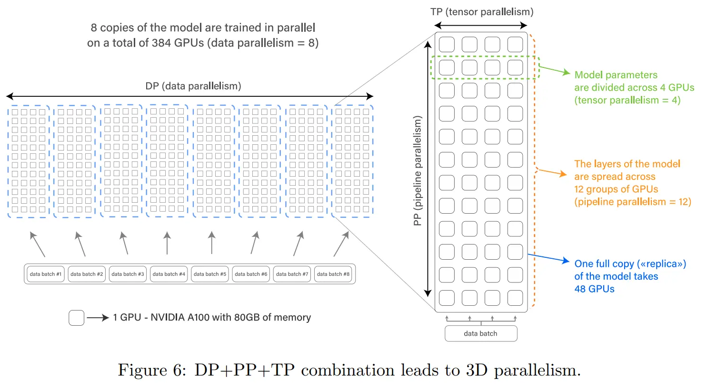

# 6.多维度混合并行

### 1.常见的分布式并行技术组合

#### 1.1 DP + PP

下图演示了如何将 DP 与 PP 结合起来使用。

这里重要的是要了解 DP rank 0 是看不见 GPU2 的， 同理，DP rank 1 是看不到 GPU3 的。对于 DP 而言，只有 GPU 0 和 1，并向它们供给数据。GPU0 使用 PP 将它的一些负载转移到 GPU2。同样地， GPU1 也会将它的一些负载转移到 GPU3 。

由于每个维度至少需要 2 个 GPU；因此，这儿至少需要 4 个 GPU。

#### 1.2 3D并行（DP + PP + TP）

而为了更高效地训练，可以将 PP、TP 和 DP 相结合，被业界称为 3D 并行，如下图所示。

由于每个维度至少需要 2 个 GPU，因此在这里你至少需要 8 个 GPU 才能实现完整的 3D 并行。

#### 1.3 ZeRO-DP + PP + TP

ZeRO，作为 DeepSpeed 的主要功能之一，它是 DP 的超级可伸缩增强版，并启发了 PyTorch FSDP 的诞生。通常它是一个独立的功能，不需要 PP 或 TP。但它也可以与 PP、TP 结合使用。

当 ZeRO-DP 与 PP 和 TP 结合使用时，通常只启用 ZeRO 阶段 1（**只对优化器状态进行分片**）。

而 ZeRO 阶段 2 还会**对梯度进行分片**，ZeRO 阶段 3 还会**对模型权重进行分片**。虽然理论上可以将 ZeRO 阶段 2 与 流水线并行一起使用，但它会对性能产生不良影响。**每个 micro batch 都需要一个额外的 reduce-scatter 通信来在分片之前聚合梯度**，这会增加潜在的显著通信开销。根据流水线并行的性质，我们会使用小的 micro batch ，并把重点放在算术强度 (micro batch size) 与最小化流水线气泡 (micro batch 的数量) 两者间折衷。因此，增加的通信开销会损害流水线并行。

此外，由于 PP，层数已经比正常情况下少，因此并不会节省很多内存。PP 已经将梯度大小减少了 `1/PP`，因此在此基础之上的梯度分片和纯 DP 相比节省不了多少内存。

除此之外，我们也可以采用 DP + TP 进行组合、也可以使用 PP + TP 进行组合，还可以使用 ZeRO3 代替 DP + PP + TP，ZeRO3 本质上是DP+MP的组合，并且无需对模型进行过多改造，使用更方便。

### 2.业界大模型混合并行策略

#### 2.1 CodeGeeX（13B）

CodeGeeX 是一个具有 130 亿参数的多编程语言代码生成预训练模型。CodeGeeX 采用华为 MindSpore 框架实现，在鹏城实验室"鹏城云脑II"中的192个节点（共1536个国产昇腾910 AI处理器）上训练而成。CodeGeeX 历时两个月在20多种编程语言的代码语料库（> 8500 亿 Token）上预训练得到。

CodeGeeX 使用纯解码器的GPT架构，并使用自回归语言建模。CodeGeeX 的核心架构是39层的Transformer解码器。在每个Transformer层包含：多头自注意力模块、MLP模块、LayerNorm和残差连接。使用类GELU的FaastGELU激活，其在Ascend 910 AI处理器上更加高效，整个模型架构如下图所示：

为了提高训练效率，CodeGeeX采用**8路模型并行组和192路数据并行组进行混合并行训练**；同时，启用 **ZeRO-2** 来进一步减少优化器状态的内存消耗。

#### 2.2 GPT-NeoX（20B）

GPT-NeoX-20B 是一个具有 200 亿参数通用的自回归密集型预训练语言模型。在12 台 Supermicro AS-4124GO-NART 服务器上进行训练；其中，每台服务器配备 8 个 NVIDIA A100-SXM4-40GB GPU，并配置了两个 AMD EPYC 7532 CPU。 所有 GPU 都可以通过用于 GPUDirect RDMA 的四个 ConnectX-6 HCA 之一直接访问 InfiniBand 交换结构（switched fabric）。两台 NVIDIA MQM8700-HS2R 交换机（通过 16 个链路连接）构成了该 InfiniBand 网络的主干，每个节点的 CPU 插槽有一个链路连接到每个交换机。每个训练节点的架构图如下所示：

GPT-NeoX-20B 采用了数据并行、流水线并行和张量并行相结合的方式进行训练。

同时，作者发现，在给定硬件设置的情况下，最有效方法是将张量并行大小设置为 2，将流水线并行大小设置为 4。这允许最通信密集的进程，张量和流水线并行发生在节点内，数据并行通信发生在节点边界之间。

#### 2.3 GLM（130B）

GLM-130B 是一个由清华开源的双语（中文和英文）双向稠密模型，拥有 1300 亿参数，模型架构采用通用语言模型（GLM）。在超过 4000 亿个文本标识符上预训练完成。GLM-130B 利用自回归空白填充作为其主要的预训练目标，以下图中的句子为例，它掩盖了随机的连续文本区间（例如，“complete unkown”），并对其进行自回归预测。

在实际训练中，GLM-130B 使用两种不同的掩码标识符（`[MASK]` 和 `[gMASK]`），分别用于短文和长文的生成。此外，它还采用了最近提出的旋转位置编码（RoPE）、DeepNorm 层规范化和高斯误差 GLU（GeGLU）技术。所有这些设计和技术都对 GLM-130B 大规模语言模型的稳定训练和高精度性能有所帮助。具体来说，GLM-130B 模型含有 70 层 Transformer，隐层维度 12,288，最大序列长度 2,048，以及一个基于 [icetk](https://link.juejin.cn?target=https://github.com/THUDM/icetk "icetk") 的 150,000 个标识符的双语分词器。

它的预训练目标由两部分组成：第一部分（95%）是自监督的预训练，即在公开的大规模语料库以及其他一些较小的中文语料库上的自回归空白填充。第二部分（5%）是在 T0++ 和 DeepStruct 中 70 个不同数据集的抽样子集上进行多任务指令预训练，格式为基于指令的多任务多提示序列到序列的生成。这种设计使 GLM-130B 可以在其他数据集上进行了零样本学习，以及从英文到中文的零样本迁移。

GLM-130B 的预训练持续了 60 天，使用 96 个 DGX-A100（40G）节点，共 768 张 GPU 卡。采用了**流水线模型并行与张量并行、数据并行策略相结合的方式**，形成 3D并行策略。

为了进一步减少流水线引入的气泡，利用 DeepSpeed 的 PipeDream-Flush 实现来训练具有相对较大的全局批量大小 (4,224) 的 GLM-130B，以减少时间和 GPU 内存浪费。 通过数值和实证检验，采用4路张量并行组和8路流水线并行组，达到每张 GPU（40G）135 TFLOP/s。

#### 2.4 OPT（175B）

OPT-175B 是 Meta AI 开源的一个拥有 1750 亿参数的语言模型，利用**完全分片数据并行（FSDP）与 Megatron-LM 张量并行（8路组）** 在 992 个 80GB A100 GPU 上训练了 OPT-175B。训练数据包含180B个token，对应800GB的数据，持续训练了约33天。

每个 GPU 的利用率高达 147 TFLOP/s。 OPT-175B 将 Adam 状态使用 FP32，并将其分片到所有主机上；而模型权重则使用 FP16。为了避免下溢，使用了动态损失缩放。

#### 2.5 Bloom（176B）

Bloom-176B 是一个拥有 1760 亿参数自回归大语言模型 (LLM)，它是迄今为止开源的最大的多语言（含46种自然语言和13种编程语言）大模型，整个模型架构如下图所示：

Bloom-176B 进行预训练时，在 384 张 NVIDIA A100 80GB GPU (48 个节点) 上使用了 3D 并行（数据并行、流水线并行、张量并行 ）策略，针对 350B 个Token 训练了大约 3.5 个月。

#### 2.6 Megatron-Turing NLG（530B）

Megatron-Turing NLG-530B 是微软和英伟达联合推出的一个包含 5300 亿参数的自回归大语言模型。使用了 Transformer 解码器的架构，其中：Transformer层数、隐藏层维度、注意力头分别为 105、20480 和 128。 序列长度为2048，全局批量大小为1920。

在训练时，每个模型副本跨越 280 个 NVIDIA A100 GPU，节点内采用Megatron-LM 的 8 路张量并行组，节点间采用 35 路流水线并行组。整个训练过程一共使用了 4480 块英伟达 A100 GPU， 在 2700 亿个 Token 上面训练。

### 3.总结

本文主要讲解了常见的大模型分布式并行技术的组合策略，同时，也讲述了目前业界的一些大模型所使用的并行策略，具体如下表所示。

| 模型                       | DP  | TP | PP | ZeRO Stage | FSDP（ZeRO Stage 3） | GPUs                    | FP16/BF16 |
| ------------------------ | --- | -- | -- | ---------- | ------------------ | ----------------------- | --------- |
| Bloom-176B               | 8   | 4  | 12 | ZeRO-1     | -                  | 384 张 A100 80GB         | BF16      |
| CodeGeeX-13B             | 192 | 8  | -  | ZeRO-2     | -                  | 1,536 张 Ascend 910 32GB | FP16      |
| GLM-130B                 | 24  | 4  | 8  | ZeRO-1     | -                  | 768 张 A100 40G          | FP16      |
| OPT-175B                 | 124 | 8  | -  | -          | ✅                  | 992 张 80GB A100         | FP16      |
| Megatron-Turing NLG-530B | 16  | 8  | 35 | N/A        | -                  | 4480 张 A100 80G         | BF16      |
| GPT-NeoX-20B             | 12  | 2  | 4  | ZeRO-1     | -                  | 96 张 A100 40G           | FP16      |
