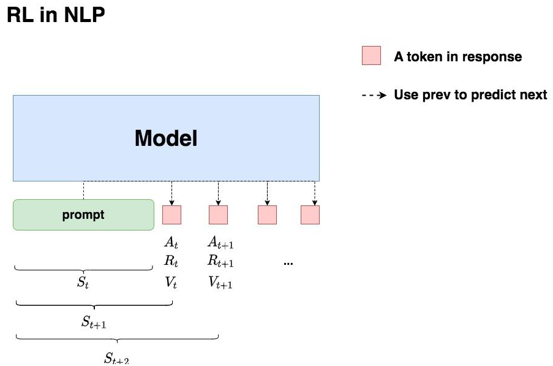
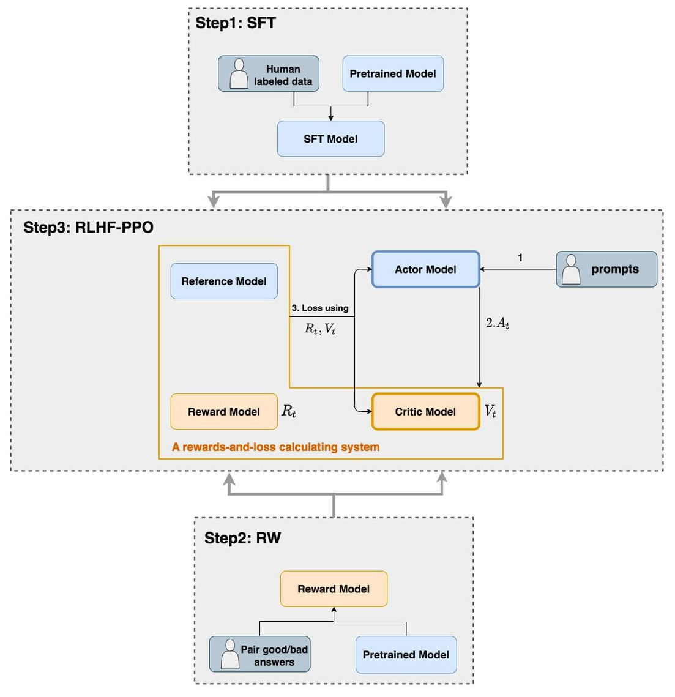
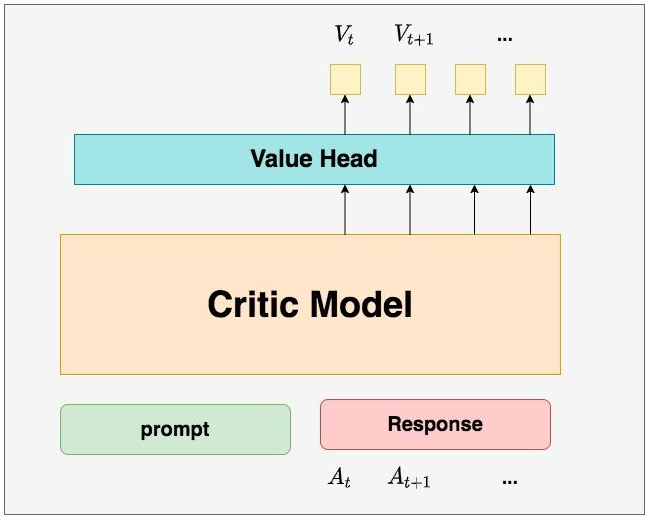
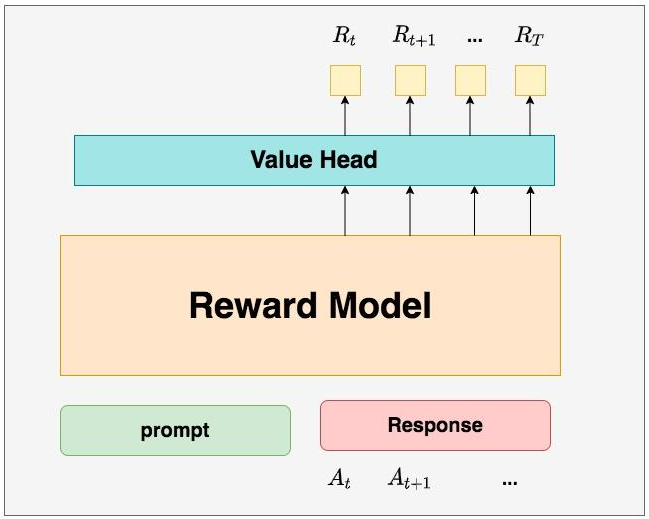
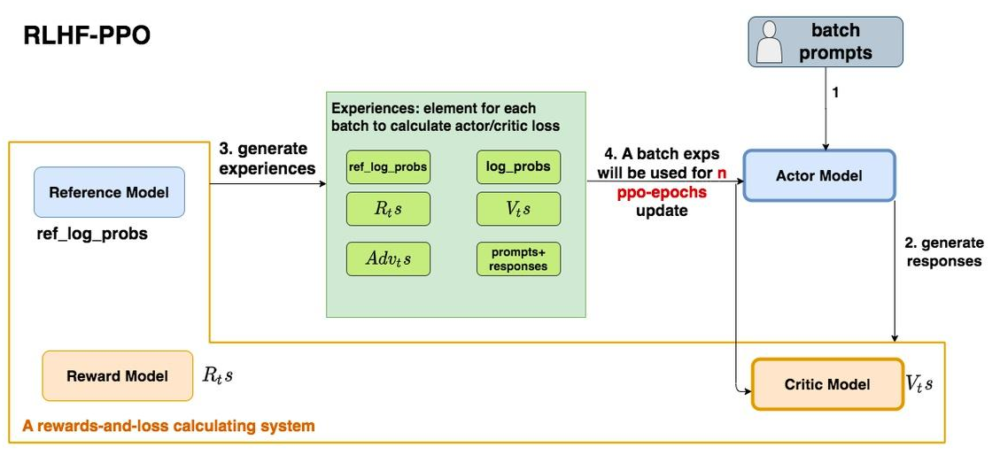

# 大模型RLHF：PPO原理与源码解读

> 原文链接：[图解大模型RLHF系列之：人人都能看懂的PPO原理与源码解读](https://zhuanlan.zhihu.com/p/677607581 "图解大模型RLHF系列之：人人都能看懂的PPO原理与源码解读")

**本文直接从一个RLHF开源项目源码入手（deepspeed-chat），根据源码的实现细节，给出尽可能丰富的训练流程图，并对所有的公式给出直观的解释。希望可以帮助大家更具象地感受RLHF的训练流程**。关于RLHF，各家的开源代码间都会有一些差异，同时也不止PPO一种RLHF方式。

## 1.强化学习概述 &#x20;

### 1.1 强化学习整体流程 &#x20;


强化学习的两个实体：**智能体（Agent）**与**环境（Environment）**

强化学习中两个实体的交互： &#x20;

-   **状态空间S**：S即为State，指环境中所有可能状态的集合
-   **动作空间A**：A即为Action，指智能体所有可能动作的集合
-   **奖励R**\*\*：\*\* R即为Reward，指智能体在环境的某一状态下所获得的奖励。

以上图为例，智能体与环境的交互过程如下： &#x20;

-   在 `t` 时刻，环境的状态为 $S_{t}$ ，达到这一状态所获得的奖励为 $R_{t}$
-   智能体观测到 $S_{t}$ 与 $R_{t}$ ，采取相应动作 $A_{t}$
-   智能体采取 $A_{t}$ 后，环境状态变为 $S_{t+1}$ ，得到相应的奖励 $R_{t+1}$

智能体在这个过程中学习，它的最终目标是：**找到一个策略，这个策略根据当前观测到的环境状态和奖励反馈，来选择最佳的动作。**&#x20;

### 1.2 价值函数

在1.1中，谈到了奖励值 $R_{t}$ ，它表示环境进入状态 $S_{t}$ 下的**即时奖励**。**但如果只考虑即时奖励，目光似乎太短浅了**：当下的状态和动作会影响到未来的状态和动作，进而影响到未来的整体收益。所以，一种更好的设计方式是：**t时刻状态s的总收益 = 身处状态s能带来的即时收益 + 从状态s出发后能带来的未来收益**\*\*。\*\* 写成表达式就是：

$$
V_{t} = R_{t} + \gamma V_{t+1}  
$$

其中： &#x20;

-   $V_{t}$ ： `t` 时刻的总收益，注意这个收益蕴涵了“即时”和“未来”的概念
-   $R_{t}$ ： `t` 时刻的即时收益
-   $V_{t+1}$ ： `t+1` 时刻的总收益，注意这个收益蕴涵了“即时”和“未来”的概念。而 $V_{t+1}$ 对 $V_{t}$ 来说就是“未来”。
-   $\gamma$ ：折扣因子。它决定了我们在多大程度上考虑将“未来收益”纳入“当下收益”。

注：在这里，不展开讨论RL中关于价值函数的一系列假设与推导，而是直接给出一个便于理解的简化结果，方便没有RL背景的朋友能倾注更多在“PPO策略具体怎么做”及“对PPO的直觉理解”上。

## 2.NLP中的强化学习

在第一部分介绍了通用强化学习的流程，那么要怎么把这个流程对应到NLP任务中呢？**换句话说，NLP任务中的智能体、环境、状态、动作等等，都是指什么呢？**



回想一下对NLP任务做强化学习（RLHF）的目的：**希望给模型一个prompt，让模型能生成符合人类喜好的response**。再回想一下GPT模型做推理的过程：**每个时刻** `t` **只产生一个token，即token是一个一个蹦出来的，先有上一个token，再有下一个token**\*\*。\*\*&#x20;

复习了这两点，现在可以更好解读上面这张图了：

-   先喂给模型一个prompt，期望它能产出符合人类喜好的response
-   在 `t` 时刻，模型根据上文，产出一个token，**这个token即对应着强化学习中的动作，记为** $A_{t}$ 。因此不难理解，在NLP语境下，强化学习任务的动作空间就对应着词表。
-   在 `t` 时刻，**模型产出token** $A_{t}$ **对应着的即时收益为** $R_{t}$ **，总收益为** $V_{t}$。这个收益即可以理解为“**对人类喜好的衡量**”。此刻，**模型的状态从** $S_{t}$ **变为** $S_{t+1}$ **，也就是从“上文”变成“上文 + 新产出的token”**
-   在NLP语境下，智能体是语言模型本身，环境则对应着它产出的语料

这样，就大致解释了NLP语境下的强化学习框架，不过针对上面这张图，可能还有以下问题：

**（1）问题1：** 图中的下标是不是写得不太对？例如根据第一部分的介绍，$A_{t}$ 应该对应着 $R_{t+1}$ ， $A_{t+1}$ 应该对应着 $R_{t+2}$ ，以此类推？

> 答：说的对。但这里不用太纠结下标的问题，只需要记住在对应的response token位置，会产生相应的即时奖励和总收益即可。之所以用图中这样的下标，是更方便后续理解代码。

**（2）问题2：** 知道$A_{t}$ 肯定是由语言模型产生的，那么 $R_t$，$ V_{t}  $是怎么来的呢，也是语言模型产生的吗？

> 答：先直接说结论， $ A_{t}  $是由我们的语言模型产生的， $R_{t}$，$V_{t}$ 则分别由另外两个模型来产生，在后文中会细说。

**（3）问题3：** 语言模型的参数在什么时候更新？是观测到一个$R_{t}$, $ V_{t}  $，就更新一次参数，然后再去产生 $A_{t+1}$ 吗？

> 答：当然不是。只看到某个时刻的收益，就急着用它更新模型，这也太莽撞了。肯定是要等有足够的观测数据了（例如等模型把完整的response生成完），再去更新它的参数。

**（4）问题4：** 再谈谈$R_{t},$ $V_{t}$ 吧，在NLP的语境下我还是不太理解它们

-   首先，“收益”的含义是“对人类喜好的衡量”
-   $R\_{t}$ ：即时收益，指语言模型当下产生token $A_{t}$ 带来的收益
-   $V_{t}$ ： 实际期望总收益（即时+未来），指对语言模型“当下产生token $A_{t}$ ，一直到整个response生产结束”后的期收益预估。因为当下语言模型还没产出 $A_{t}$ 后的token，所以只是对它之后一系列动作的收益做了估计，因而称为“期望总收益”。

## 3.RLHF中的四个重要角色

本节中，在第二部分的基础上更进一步：更详细理清NLP语境下RLHF的运作流程。

从第二部分中已经知道：生成token $A_{t}$ 和对应收益 $R_{t}$, $V_{t}$ 的并不是一个模型。那么在RLHF中到底有几个模型？他们是怎么配合做训练的？而我们最终要的是哪个模型？



如上图，**在RLHF-PPO阶段，一共有四个主要模型**，分别是： &#x20;

-   **Actor Model**\*\*：演员模型\*\*，这就是**想要训练的目标语言模型**
-   **Critic Model**\*\*：评论家模型\*\*，它的作用是\*\*预估总收益 \*\*$V_{t}$
-   **Reward Model**\*\*：奖励模型\*\*，它的作用是\*\*计算即时收益 \*\*$R_{t}$
-   **Reference Model**\*\*：参考模型\*\*，它的作用是**在RLHF阶段给语言模型增加一些“约束”，防止语言模型训歪**（朝不受控制的方向更新，效果可能越来越差）

其中:

-   **Actor/Critic Model**在RLHF阶段是**需要训练**的（图中给这两个模型加了粗边，就是表示这个含义）；而**Reward/Reference Model**是**参数冻结**的。
-   Critic/Reward/Reference Model共同组成了一个“奖励-loss”计算体系（自己命名的，为了方便理解），综合它们的结果计算loss，用于更新Actor和Critic Model

我们把这四个部分展开说说。

### 3.1 Actor Model (演员模型)

正如前文所说，**Actor就是想要训练的目标语言模型。****一般用SFT阶段产出的SFT模型来对它做初始化****。**&#x20;


最终目的是**让Actor模型能产生符合人类喜好的response**。所以策略是，先喂给Actor一条prompt （这里假设`batch_size = 1`，所以是1条prompt），让它生成对应的response。然后，再将“prompt + response"送入我们的“奖励-loss”计算体系中去算得最后的loss，用于更新actor。

### 3.2 Reference Model（参考模型）

**Reference Model（以下简称Ref模型）****一般也用SFT阶段得到的SFT模型做初始化****，****在训练过程中，它的参数是冻结的****。** Ref模型的主要作用是防止Actor“训歪”，那么它具体是怎么做到这一点的呢？


“防止模型训歪”换一个更详细的解释是：**希望训练出来的Actor模型既能达到符合人类喜好的目的，又尽量让它和SFT模型不要差异太大**。简言之，**希望两个模型的输出分布尽量相似**。那什么指标能用来衡量输出分布的相似度呢？自然而然想到了**KL散度**。

如图所示：

-   **对Actor模型**，喂给它一个`prompt`，它正常输出对应的response。那么response中每一个token肯定有它对应的log\_prob结果，把这样的结果记为\*\*`log_probs`\*\*
-   **对Ref模型**，把Actor生成的`"prompt + response"`喂给它，那么它同样能给出每个token的log\_prob结果，我们记其为\*\*`ref_log_probs`\*\*
-   那么这两个模型的输出分布相似度就可以用`ref_log_probs - log_probs`来衡量，可以从两个方面来理解这个公式： &#x20;
    -   **从直觉上理解**，`ref_log_probs`越高，说明Ref模型对Actor模型输出的肯定性越大。即Ref模型也认为，对于某个 $S_{t}$ ，输出某个 $A_{t}$ 的概率也很高$ P(A_{t} | S_{t})  $）。这时可以认为Actor模型较Ref模型没有训歪。
    -   **从KL散度上理解**， $ KL[Actor(X) || Ref(X)] = E_{x\sim Actor(x)}[log\frac{Actor(x)}{Ref(x)}] = log\_probs - ref\_log\_probs  $（当然这里不是严格的等于，只是KL散度的近似），这个值越小意味着两个分布的相似性越高。

注：可能已经注意到，按照KL散度的定义，这里写成`log_probs - ref_log_probs`更合适一些。但是如果你看过一些RLHF相关的论文的话，可能记得在计算损失函数时，有一项 $R_{t} - KL$散度 （对这个有疑惑不要紧，我们马上在后文细说），即KL散度前带了负号，所以这里我写成`ref_log_probs - log_probs`这样的形式，更方便大家从直觉上理解这个公式。

现在，已经知道**怎么利用Ref模型和KL散度来防止Actor训歪了**。**KL散度将在后续被用于loss的计算**。

### 3.3 Critic Model（评论家模型）

**Critic Model用于****预测期望总收益 \*\*$V_{t}$ \*\*，和Actor模型一样，它需要****做参数更新**。实践中，Critic Model的设计和初始化方式也有很多种，例如和Actor共享部分参数、从RW阶段的Reward Model初始化而来等等。我们讲解时，和deepspeed-chat的实现保持一致：从RW阶段的Reward Model初始化而来。

**你可能想问：训练Actor模型我能理解，但我还是不明白，为什么要单独训练一个Critic模型用于预测收益呢？**

> 这是因为，当我们在前文讨论总收益 $V_{t}$ （即时 + 未来）时，我们是站在上帝视角的，也就是这个 $V_{t}$ 就是客观存在的、真正的总收益。但是在训练模型时，就没有这个上帝视角加成了，**也就是在** `t` **时刻，给不出客观存在的总收益** $V_{t}$ **，只能训练一个模型去预测它**\*\*。\*\*&#x20;

**所以总结来说，在RLHF中，不仅要训练模型生成符合人类喜好的内容的能力（Actor），也要提升模型对人类喜好量化判断的能力（Critic）**。这就是Critic模型存在的意义。来看看它的大致架构：



deepspeed-chat采用了**Reward模型作为它的初始化**，所以这里也按Reward模型的架构来简单画画它。你可以简单理解成，Reward/Critic模型和Actor模型的架构是很相似的（毕竟输入都一样），同时，它在最后一层增加了一个Value Head层，该层是个简单的线形层，用于将原始输出结果映射成单一的 $V\_{t}$ 值。

在图中， $V\_{t}$ 表示Critic模型对 `t` 时刻及未来（response完成）的收益预估。

### 3.4 Reward Model（奖励模型）

Reward Model用于**计算生成token **$A_{t}$** 的即时收益**，它就是RW阶段所训练的奖励模型，在RLHF过程中，它的**参数是冻结的**。

**你可能想问：为什么Critic模型要参与训练，而同样是和收益相关的Reward模型的参数就可以冻结呢？** 这是因为，Reward模型是站在上帝视角的。这个上帝视角有两层含义：

-   第一点，Reward模型是经过和“估算收益”相关的训练的，因此在RLHF阶段它可以直接被当作一个能产生客观值的模型。
-   第二点，Reward模型代表的含义就是“**即时收益**”，你的token $A_{t}$ 已经产生，因此即时收益自然可以立刻算出。

**你还可能想问：已经用Critic预测出** $V_{t}$ **了，而这个** $V_{t}$ **包含了“即时”和“未来”的概念，那还需要代表“即时”的** $R_{t}$ **做什么呢？直接用** $V_{t}$ **不就好了吗？**

为了解答这个问题，先回顾下1.2部分中给出的价值函数： $ V_{t} = R_{t} + \gamma V_{t+1}  $&#x20;

这个函数告诉我们，当前可以用两个结果来表示 `t` 时刻的总收益：

-   结果1：Critic模型预测的 $V_{t}$
-   结果2：Reward模型预测的 $R_{t}$ 和critic模型预测的 $V_{t+1}$

那么哪一个结果更靠近上帝视角给出的客观值呢？当然是结果2，因为结果1全靠预测，而结果2中的 $R_{t}$ 是事实数据。我们知道Critic模型也是参与参数更新的，可以用`MSE(上帝视角的客观收益-Critic模型预测的收益)`来衡量它的loss。**但是上帝视角的客观收益是不知道的，只能用已知事实数据去逼近它，所以我们就用** $ R_{t} + \gamma * V_{t+1}  $**来做近似。** 这就是 $ R_{t}, V_{t}  $同时存在的意义。 &#x20;

Reward模型和critic模型非常相似，这里就只给出架构图，不再做过多的说明。关于Reward模型的训练过程，后续有时间也会出个原理和代码解析。


## 4.RLHF中的loss计算

到目前为止，已经基本了解了RLHF的训练框架，以及其中的四个重要角色（训练一个RLHF，有4个模型在硬件上跑，可想而知对存储的压力）。在本节中，一起来解读RLHF的loss计算方式。在解读中，会再一次理一遍RLHF的整体训练过程，填补相关细节。在这之后，就可以来看代码解析了。

在第三部分的讲解中，我们知道**Actor和Critic模型都会做参数更新**，所以loss也分成2个：

-   **Actor loss：** 用于**评估Actor是否产生了符合人类喜好的结果**，将作用于Actor的BWD上。
-   **Critic loss**\*\*：\*\* 用于**评估Critic是否正确预测了人类的喜好**，将作用于Critic的BWD上。

### 4.1 Actor loss

### （1）直观设计

先来看一个直观的loss设计方式： &#x20;

-   Actor接收到当前上文 $S_{t}$ ，产出token $A_{t}$ （ $P(A_{t} | S_{t})$ ）
-   Critic根据 $S_{t}$, $A_{t}$ ，产出对总收益的预测 $V_{t}$
-   那么Actor loss可以设计为： $actor\_loss =- \sum_{t \in { response\_timestep }} V_{t} \log P (A_{t} | S_{t})$

求和符号表示只考虑response部分所有token的loss，为了表达简便，先把这个求和符号略去（下文也是同理），也就是说：

$$
actor\_loss =-V_{t} \log P\left(A_{t} \mid S_{t}\right)
$$

我们希望minimize这个`actor_loss`。

**这个设计的直观解释是：**&#x20;

-   当 $V_{t}>0$ 时，意味着Critic对Actor当前采取的动作给了正向反馈，因此就需要在训练迭代中提高 $ P(A_{t} | S_{t})  $，这样就能达到减小loss的作用。
-   当 $V_{t} < 0$ 时，意味着Critic对Actor当前采取的动作给了负向反馈，因此就需要在训练迭代中降低 $P(A_{t} | S_{t})$ ，这样就能到达到减小loss的作用。

**一句话总结：这个loss设计的含义是，****对上文** $S_{t}$ **而言，如果token** $A_{t}$ **产生的收益较高，那就增大它出现的概率，否则降低它出现的概率****。**&#x20;

### （2）引入优势（Advantage）

在开始讲解之前，举个小例子：假设在王者中，中路想支援发育路，这时中路有两种选择：1. 走自家野区。2. 走大龙路。中路选择走大龙路，当做出这个决定后，Critic告诉她可以收1个人头。结果，此刻对面打野正在自家采灵芝，对面也没有什么苟草英雄，中路一路直上，最终收割2个人头。因为实际收割的人头比预期要多1个，中路尝到了甜头，所以增大了“支援发育路走大龙路”的概率。**这个多出来的“甜头”，就叫做“优势”(Advantage)。**&#x20;

**对NLP任务来说，如果Critic对** $A_{t}$ **的总收益预测为** $V_{t}$ **，但实际执行** $A_{t}$ **后的总收益是** $R_{t} + \gamma * V_{t+1}$ **，我们就定义****优势****为：**&#x20;

$$
Adv_{t} = R_{t} + \gamma * V_{t+1} - V_{t}
$$

用 $Adv_{t}$ 替换掉 $ V_{t}  $，则此刻`actor_loss`变为：
$actor\_loss = -Adv_{t}log P(A_{t}|S_{t})$

### （3）重新设计 $R_{t}$

总结一下，到目前为止，我们的`actor_loss`形式为：

$$
actor\_loss = -Adv_{t}log P(A_{t}|S_{t})
$$

其中， $ Adv_{t} = R_{t} + \gamma * V_{t+1} - V_{t}   $

同时注意，这个`actor_loss`应该是response的所有token loss的sum或者avg。这里为了表达方便，公式略去了求和或求平均的符号。

按照这个理解， $R_{t}$ 应该表示每个Actor产出token $A_{t}$ 带来的即时收益，正如下图所示（其中 `T` 表示最后一个时刻）：



但在deepspeed-chat的RLHF实践中，对 $R_{t}$ 做了另一种设计：

$$
\left\{\begin{array}{l}R_{t}=-k l \_c t l *\left(\log \frac{P\left(A_{t} \mid S_{t}\right)}{P_{\text {ref }}\left(A_{t} \mid S_{t}\right)}\right), t \neq T \\ R_{t}=-k l \_c t l *\left(\log \frac{P\left(A_{t} \mid S_{t}\right)}{P_{\text {ref }}\left(A_{t} \mid S_{t}\right)}\right)+R_{t}, t=T\end{array}\right.
$$

-   `kl_ctl`：常量，可以理解成是一个控制比例的缩放因子，在deepspeed-chat中默认设为0.1
-   $ -log\frac{P(A_{t}|S_{t})}{P_{ref}(A_{t}|S_{t})}  $：这一项是不是非常眼熟，这就是在3.2部分介绍的Actor和Ref模型间的KL散度，写成更容易理解的形式，就是`ref_log_probs - log_probs`。在3.2中说过，为了防止模型训歪，需要把这个KL散度加入loss计算中，所以这里我们就在做这件事

**基于这些，上面这个对** $R_{t}$ **的设计可理解成：**&#x20;

-   **当** $t \neq T$ **时，更加关心Actor是否有在Ref的约束下生产token** $A_{t}$
-   **当**$t =T$ **时，不仅关心Actor是否遵从了Ref的约束，也关心真正的即时收益** $R_{t}$

为什么只有最后一个时刻的 $R_{t}$ 被纳入了考量呢？这是因为在Reward模型训练的时候，就是用这个位置的 $R_{t}$ 来表示对完整的prompt + response的奖励预测（但你依然可以理解成是执行完 $A_{T}$ 的即时奖励）。所以到了RLHF的场景下，其余时刻的即时奖励，就用“Actor是否遵循了Ref的约束”来进行评价。

需要注意的是， $R_{t}$ 的设计并不只有这一种。deepspeed在自己的代码注释中也有提过，可以尝试把最后一个时刻的 $R_{T}$ 替换成所有token的即时奖励的平均值（因为在Reward模型中，每一个token位置照样会有对应的奖励值输出，只是它们不像最后一个位置那样用对应的真值经过了训练，这个真值就是指人标注的对整个prompt + response的奖励真值）。如果站在这个角度理解的话，同样也可以尝试在每一个位置的奖励衡量上引入 $R_{t}$ 。

代码实践如下：

```python
def compute_rewards(self, prompts, log_probs, ref_log_probs, reward_score,
                        action_mask):
        """
        reward_function：计算最终的reward分数
        复习一下几个相关参数的默认值：
        self.kl_ctl = 0.1
        self.clip_reward_value = 5
        
        对于batch中的某个prompt来说，它最终的reward分数为：
        (1) 先计算actor和ref_model的logit相似度： -self.kl_ctl * (log_probs - ref_log_probs)
            其实写成self.kl_ctl * (ref_log_probs - log_probs)更好理解些
            这个值越大，说明ref_model对actor生成的结果的认可度越高（即表明rlhf没有训歪），
            没有训歪的情况下我们也应该给模型一些奖励，这个奖励就是self.kl_ctl * (ref_log_probs - log_probs)
            
        （2）由于我们只取最后一个token对应位置的分数作为reward_score，因此我们只需要：
            self.kl_ctl * (ref_log_probs - log_probs)的最后一位 + reward_score
         
         (3) 同时我们对reward_score也做了大小限制，最大不超过self.clip_reward_value（超过统一给成self.clip_reward_value），
             最小不低于-self.clip_reward_value（低于统一给成-self.clip_reward_value）
        
         (4) 最后返回的rewards大小为：（batch_size, 各条数据的长度），对batch中的每条数据来说：
             - response的最后一位：self.kl_ctl * (ref_log_probs - log_probs)的最后一位 + reward_score
             - response的其余位置：self.kl_ctl * (ref_log_probs - log_probs)
        
        """

        kl_divergence_estimate = -self.kl_ctl * (log_probs - ref_log_probs)
        rewards = kl_divergence_estimate
        # ---------------------------------------------------------------------------------------------------
        # response开始的位置
        # （因为我们对prompt做过padding处理，因此batch中每个prompt长度一致，也就意味着每个response开始的位置一致）
        # （所以这里start是不加s的，只是一个int）
        # ---------------------------------------------------------------------------------------------------
        start = prompts.shape[1] - 1
        # ---------------------------------------------------------------------------------------------------
        # response结束的位置
        # （因为一个batch中，每个response的长度不一样，所以response的结束位置也不一样）
        # （所以这里end是加s的，ends的尺寸是(batch_size,)
        # ---------------------------------------------------------------------------------------------------
        ends = start + action_mask[:, start:].sum(1) + 1
        # ---------------------------------------------------------------------------------------------------
        # 对rewards_score做限制
        # ---------------------------------------------------------------------------------------------------
        reward_clip = torch.clamp(reward_score, -self.clip_reward_value,
                                  self.clip_reward_value)
        batch_size = log_probs.shape[0]
        for j in range(batch_size):
            rewards[j, start:ends[j]][-1] += reward_clip[j] # 

        return rewards
```

### （4）重新设计优势

好，再总结一下，目前为止的`actor_loss`为：

$$
actor_loss =-A d v_{t} \log P\left(A_{t} \mid S_{t}\right)
$$

其中， $ Adv_{t} = R_{t} + \gamma * V_{t+1} - V_{t}   $

同时，对 $R_{t}$ 进行来改造，使其能够衡量Actor模型是否遵从了Ref模型的约束。

现在把改造焦点放在 $Adv_{t}$ 上，回想一下，**既然对于收益而言，分为即时和未来，那么对于优势而言，是不是也能引入对未来优势的考量呢**？这样，就可以把 $Adv_{t}$ 改写成如下形式：

$$
A d v_{t}=\left(R_{t}+\gamma * V_{t+1}-V_{t}\right)+\gamma * \lambda * A d v_{t+1}
$$

（熟悉强化学习的朋友应该能一眼看出这是GAE，这里不打算做复杂的介绍，一切都站在直觉的角度理解）**其中，新引入的** $\lambda$ **也是一个常量，可将其理解为权衡因子，直觉上看它控制了在计算当前优势时对未来优势的考量。（从强化学习的角度上，它控制了优势估计的方差和偏差）**

**看到这里，你可能想问：这个代表未来优势的** $ Adv_{t+1}  $**，那要怎么算呢？** 注意到，对于最后一个时刻`t` ，它的未来收益（$V_{T+1}$ ）和未来优势（$Adv_{T+1}$ ）都是0，也就是 $Adv_{T} = R_{T} - V_{T}$ ，这是可以直接算出来的。**而有了** $Adv_{T}$ **，不就能从后往前，通过动态规划的方法，把所有时刻的优势都依次算出来了吗？**

代码实践如下（其中返回值中的returns表示实际收益，将被用于计算Critic模型的loss，可以参见4.2，其余细节都在代码注释中）：

```python
def get_advantages_and_returns(self, values, rewards, start):
       """
       Adopted from https://github.com/CarperAI/trlx/blob/main/trlx/models/modeling_ppo.py#L134
     
       没有引入GAE前的t时刻的优势值·：
       detal_t = r_t + gamma * V_t+1 - V_t
       其中：
           - r_t表示t时刻的即时收益
           - V_t+1表示未来时刻的预期收益
           - r_t + gamma * V_t+1可理解成t时刻的实际预期收益
           - V_t可理解成t时刻的预估预期收益（是模型，例如critic model自己估算出来的）
       
       引入GAE后的t时刻的优势值：
       A_t = delta_t + gamma * lambda * A_t+1
       粗暴理解为在t时刻时，不仅考虑当下优势，还考虑了未来的优势
       为了知道A_t, 我们得知道A_t+1，所以在本算法中采取了从后往前做动态规划求解的方法，也即：
       假设T是最后一个时刻，则有A_T+1 = 0, 所以有: A_T = delta_T
       知道了A_T, 就可以依次往前倒推，把A_t-1, A_t-2之类都算出来了
       
       引入GAE后t时刻的实际预期收益
       returns_t = A_t + V_t
                 = delta_t + gamma * lambda * A_t+1 + V_t
                 = r_t + gamma * V_t+1 - V_t + gamma * lambda * A_t+1 + V_t
                 = r_t + gamma * (V_t+1 + lambda * A_t+1)
       
       注意，这里不管是advantages还是returns，都只算response的部分
       """
       
       # Adopted from https://github.com/CarperAI/trlx/blob/main/trlx/models/modeling_ppo.py#L134
       lastgaelam = 0
       advantages_reversed = []
       length = rewards.size()[-1]
       # 注意这里用了reversed，是采取从后往前倒推计算的方式
       for t in reversed(range(start, length)):
           nextvalues = values[:, t + 1] if t < length - 1 else 0.0
           delta = rewards[:, t] + self.gamma * nextvalues - values[:, t]
           lastgaelam = delta + self.gamma * self.lam * lastgaelam
           advantages_reversed.append(lastgaelam)
       advantages = torch.stack(advantages_reversed[::-1], dim=1) # 优势
       returns = advantages + values[:, start:] # 实际收益
       # values: 预期收益
       return advantages.detach(), returns
```

### （5）PPO-epoch: 引入新约束

总结一下，目前为止的`actor_loss`为：

$$
actor\_loss = -Adv_{t}log P(A_{t}|S_{t})
$$

其中， $ Adv_{t} = (R_{t} + \gamma * V_{t+1} - V_{t}) + \gamma * \lambda * Adv_{t+1}   $

同时

-   **已经对** $R_{t}$ **进行来改造，使其能够衡量Actor模型是否遵从了Ref模型的约束。**&#x20;
-   **已经对**$Adv_{t}$ **进行改造，使其不仅考虑了当前时刻的优势，还考虑了未来的优势**

基于这些改造，重新理一遍**RLHF-PPO**的训练过程。



-   第一步，准备一个batch的prompts
-   第二步，将这个batch的prompts喂给Actor模型，让它生成对应的responses
-   第三步，把prompt+responses喂给我们的Critic/Reward/Reference模型，让它生成用于计算actor/critic loss的数据，按照强化学习的术语，称这些数据为经验（experiences）。critic loss我们将在后文做详细讲解，目前只把目光聚焦到actor loss上
-   第四步，根据这些经验，实际计算出actor/critic loss，然后更新Actor和Critic模型

这些步骤都很符合直觉，但是细心的你肯定发现了，**文字描述中的第四步和图例中的第四步有差异：图中说，这一个batch的经验值将被用于n次模型更新，这是什么意思呢？**

**在强化学习中，收集一个batch的经验是非常耗时的。对应到RLHF的例子中，收集一次经验，它要等四个模型做完推理才可以**，正是因此，一个batch的经验，只用于计算1次loss，更新1次Actor和Critic模型，好像有点太浪费了。

所以，自然而然想到，**1个batch的经验，能不能用来计算ppo-epochs次loss，更新ppo-epochs次Actor和Critic模型？** 简单写一下伪代码，我们想要：

```python
# --------------------------------------------------------------
# 初始化RLHF中的四个模型
# --------------------------------------------------------------
actor, critic, reward, ref = initialize_models()

# --------------------------------------------------------------
# 训练
# --------------------------------------------------------------
# 对于每一个batch的数据
for i in steps: 
    # 先收集经验值
    exps = generate_experience(prompts, actor, critic, reward, ref)
    # 一个batch的经验值将被用于计算ppo_epochs次loss，更新ppo_epochs次模型
    # 这也意味着，当你计算一次新loss时，你用的是更新后的模型
    for j in ppo_epochs:
        actor_loss = cal_actor_loss(exps, actor)
        critic_loss = cal_critic_loss(exps, critic)
        
        actor.backward(actor_loss)
        actor.step()
        
        critc.backward(critic_loss)
        critic.step()
```

**而如果想让一个batch的经验值被重复使用ppo\_epochs次，等价于想要Actor在这个过程中，模拟和环境交互**\*\*`ppo_epochs`\*\***次。** 举个例子：

-   如果1个batch的经验值只使用1次，那么在本次更新完后，Actor就吃新的batch，正常和环境交互，产出新的经验值
-   但如果1个batch的经验值被使用`ppo_epochs`次，在这`ppo_epochs`中，Actor是不吃任何新数据，不做任何交互的，所以只能让Actor“模拟”一下和环境交互的过程，吐出一些新数据出来。

那怎么让Actor模拟呢？很简单，让它观察一下之前的数据长什么样，让它依葫芦画瓢，不就行了吗？**假设最开始吃batch，吐出经验的actor叫**$Actor_{old}$ **，而在伪代码中，每次做完**\*\*`ppo_epochs`\*\***而更新的actor叫** $Actor_{new}$ **，那么只要尽量保证每次更新后的** $Actor_{new}$ **能模仿最开始的那个** $Actor_{old}$ **，不就行了吗？**

诶！是不是很眼熟！**两个分布**，通过什么方法让它们相近！**那当然是KL散度**！所以，再回到我们的`actor_loss`上来，它现在就可被改进成：$actor\_loss = -Adv_{t}log \frac{P(A_{t}|S_{t})}{P_{old}(A_{t}|S_{t})}$

再稍作一些改动将log去掉（这个其实不是“稍作改动去掉log”的事，是涉及到PPO中重要性采样的相关内容，大家有兴趣可以参考[这篇](https://link.zhihu.com/?target=https%3A//www.cnblogs.com/xingzheai/p/15931681.html "这篇")）：$actor\_loss = -Adv_{t} * \frac{P(A_{t}|S_{t})}{P_{old}(A_{t}|S_{t})}$

其中，$P_{old}$ 表示真正吃了batch，产出经验值的Actor；P表示`ppo_epochs`中实时迭代更新的Actor，它在模仿 $ P_{old}  $的行为。**所以这个公式从直觉上也可以理解成：****在Actor想通过模拟交互的方式，使用一个batch的经验值更新自己时，它需要收到真正吃到batch的那个时刻的Actor的约束，这样才能在有效利用batch，提升训练速度的基础上，保持训练的稳定****。**&#x20;

但是，此时又有新的担心了：**虽然在更新Actor的过程中用** $Actor_{old}$ **做了约束，但如果** $Actor_{old}$ **的约束能力不够，比如说** $ \frac{P(A_{t} | S_{t})}{P_{old}(A_{t} | S_{t})}  $**还是超出了可接受的范围，那怎么办？**

很简单，那就**剪裁（clip）** 它吧！

我们给 $\frac{P(A_{t} | S_{t})}{P_{old}(A_{t} | S_{t})}$ 设置一个范围，例如`(0.8 ,1.2)`，也就是如果这个值一旦超过1.2，那就统一变成1.2；一旦小于0.8，那就统一变成0.8。这样就能保证 $ Actor  $和$Actor_{old}$ 的分布相似性在我们的掌控之内了。此时`actor_loss`变为：

$$
actor_loss =-\min \left(\operatorname{Adv} v_{t} * \frac{P\left(A_{t} \mid S_{t}\right)}{P_{\text {old }}\left(A_{t} \mid S_{t}\right)}, \operatorname{Adv} v_{t} * \operatorname{clip}\left(\frac{P\left(A_{t} \mid S_{t}\right)}{P_{\text {old }}\left(A_{t} \mid S_{t}\right)}, 0.8,1.2\right)\right)
$$

这时要注意，如果超过变化范围，将 $\frac{P(A_{t} | S_{t})}{P_{old}(A_{t} | S_{t})}$ 强制设定为一个常数后，就说明这一部分的loss和Actor模型无关了，而 $Adv_{t}$ 这项本身也与Actor无关。**所以相当于，在超过约束范围时，我们停止对Actor模型进行更新。**&#x20;

整体代码如下：

```python
def actor_loss_fn(self, logprobs, old_logprobs, advantages, mask):
    """
    logprobs: 实时计算的，response部分的prob（只有这个是随着actor实时更新而改变的）
    old_logprobs：老策略中，response部分的prob （这个是固定的，不随actor实时更新而改变）
    advantages： 老策略中，response部分每个token对应的优势（这个是固定的，不随actor实时更新而改变）
    mask：老策略中，response部分对应的mask情况这个是固定的，不随actor实时更新而改变）
    
    之所以要引入logprobs计算actor_loss，是因为我们不希望策略每次更新的幅度太大，防止模型训歪
    
    self.cliprange: 默认值是0.2
    """
    ## policy gradient loss
    # -------------------------------------------------------------------------------------
    # 计算新旧策略间的KL散度
    # -------------------------------------------------------------------------------------
    log_ratio = (logprobs - old_logprobs) * mask
    ratio = torch.exp(log_ratio)
    # -------------------------------------------------------------------------------------
    # 计算原始loss和截断loss
    # -------------------------------------------------------------------------------------
    pg_loss1 = -advantages * ratio
    pg_loss2 = -advantages * torch.clamp(ratio, 1.0 - self.cliprange, 1.0 + self.cliprange)
    pg_loss = torch.sum(torch.max(pg_loss1, pg_loss2) * mask) / mask.sum() # 最后是取每个非mask的response token的平均loss作为最终loss
    return pg_loss
```

### （6）Actor loss小结

（1）～（5）中我们一步步树立了`actor_loss`的改进过程，这里就做一个总结吧：

$$
actor\_loss =-\min \left(\operatorname{Adv} v_{t} * \frac{P\left(A_{t} \mid S_{t}\right)}{P_{\text {old }}\left(A_{t} \mid S_{t}\right)}, \operatorname{Adv} v_{t} * \operatorname{clip}\left(\frac{P\left(A_{t} \mid S_{t}\right)}{P_{\text {old }}\left(A_{t} \mid S_{t}\right)}, 0.8,1.2\right)\right.
$$

其中：

-   $A d v_{t}=\left(R_{t}+\gamma * V_{t+1}-V_{t}\right)+\gamma * \lambda * A d v_{t+1}$
-   **已经对** $R_{t}$ **进行来改造，使其能够衡量Actor模型是否遵从了Ref模型的约束**
-   **已经对** $ Adv_{t}  $**进行改造，使其不仅考虑了当前时刻的优势，还考虑了未来的优势**
-   **重复利用了1个batch的数据，使本来只能被用来做1次模型更新的它现在能被用来做**\*\*`ppo_epochs`****次模型更新。使用真正吃了batch，产出经验值的那个时刻的Actor分布来约束****`ppo_epochs`\*\***中更新的Actor分布**
-   **考虑了****剪裁机制（clip****），在**\*\*`ppo_epochs`次更新中，一旦Actor的更新幅度超过我们的控制范围，则不对它进行参数更新。\*\*

### 4.2 Critic loss

我们知道，1个batch产出的经验值，不仅被用来更新Actor，还被用来更新Critic。对于Critic loss，不再像Actor loss一样给出一个“演变过程”的解读，直接来看它最后的设计。

首先，在之前的解说中，你可能有这样一个印象：

-   $ V_{t}  $：Critic对`t`时刻的总收益的预估，这个总收益包含即时和未来的概念（预估收益）
-   $ R_{t} + \gamma * V_{t+1}  $：Reward计算出的即时收益 $R_{t}$ ，Critic预测出的 `t+1` 及之后时候的收益的折现，这是比 $V_{t}$ 更接近`t`时刻真值总收益的一个值（实际收益）

所以，我们的第一想法是：$Critic\_loss =\left(R_{t}+\gamma * V_{t+1}-V_{t}\right)^{2}$

现在，对“实际收益”和“预估收益”都做一些优化。

### （1）实际收益优化

原始的实际收益为 $ R_{t} + \gamma * V_{t+1}  $，但是当在`actor_loss`中引入“优势”的概念时，“优势”中刻画了更为丰富的实时收益信息，所以，将实际收益优化为： $Adv_{t} + V_{t}$

### （2）预估收益优化

原始的预估收益为 $ V_{t}  $。  类比于Actor，Critic模型在`ppo_epochs`的过程中也是不断更新的。所以这个 $V_{t}$ 可以理解成是 $Critic_{old}$ ，也就是真正吃了batch，参与产出经验的那个时候的Critic产出的收益预测结果。

同样想用旧模型去约束新模型，但对于Critic采用的约束策略就比较简单了，直接看代码，从中可以看出，用老 $V_{t}$ 设计了了一个变动范围，然后用这个变动范围去约束新 $V_{t}$

```python
# self.cliprange_value是一个常量
# old_values: 老critic的预测结果
# values：新critic的预测结果
values_clipped = torch.clamp(
            values,
            old_values - self.cliprange_value,
            old_values + self.cliprange_value,
        )
```

那么最终就取实际收益和预估收益的MSE做为loss就好，这里注意，计算实际收益时 $Adv_{t}$, $V_{t}$ 都是老Critic（真正吃了batch的那个）产出的结果，而预估收益是随着`ppo_epochs`而变动的。

代码如下：

```python
def critic_loss_fn(self, values, old_values, returns, mask):
        """
        values: 实时critic跑出来的预估预期收益（是变动的，随着ppo epoch迭代而改变）
        old_values：老critic跑出来的预估预期收益（是固定值）
        returns：实际预期收益
        mask：response部分的mask
        
        self.cliprange_value = 0.2
        """
        ## value loss
        # 用旧的value去约束新的value
        values_clipped = torch.clamp(
            values,
            old_values - self.cliprange_value,
            old_values + self.cliprange_value,
        )
        if self.compute_fp32_loss:
            values = values.float()
            values_clipped = values_clipped.float()
        
        # critic模型的loss定义为（预估预期收益-实际预期收益）**2
        vf_loss1 = (values - returns)**2
        vf_loss2 = (values_clipped - returns)**2
        vf_loss = 0.5 * torch.sum(
            torch.max(vf_loss1, vf_loss2) * mask) / mask.sum() # 同样，最后也是把critic loss平均到每个token上
        return vf_loss
```
